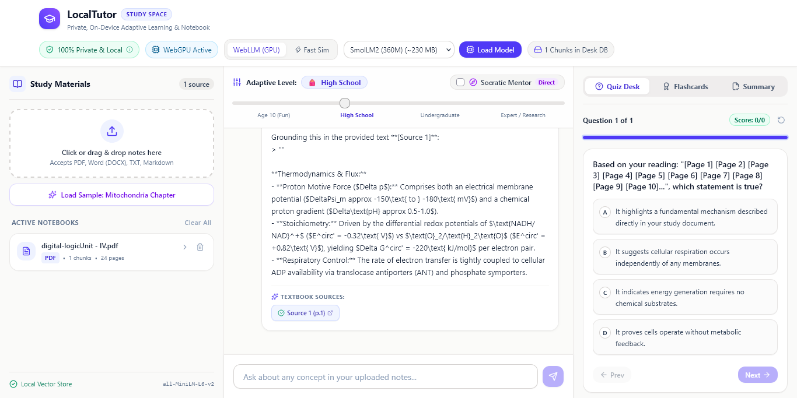

# A Local NotebookLM Alternative, Built with WebLLM LocalTutor 🎓

**A private, browser-based adaptive AI tutor. A NotebookLM-style study desk that runs on your own machine.**

LocalTutor lets you upload study material (PDFs, Word documents, plain text or Markdown) and chat with a tutor that answers from *your* documents, with clickable source citations, adjustable reading levels, and an optional Socratic mode. Parsing, embedding, vector search, storage and LLM inference all happen inside the browser: there is no backend and no API key.


---

## Table of Contents

1. [Overview](#overview)
2. [Features](#features)
3. [How It Works](#how-it-works)
4. [Tech Stack](#tech-stack)
5. [Getting Started](#getting-started)
6. [Configuration](#configuration)
7. [Usage Guide](#usage-guide)
8. [Supported Models](#supported-models)
9. [Project Structure](#project-structure)
10. [Data Model](#data-model)
11. [Privacy & Security Notes](#privacy--security-notes)
12. [Known Limitations](#known-limitations)
13. [Roadmap](#roadmap)
14. [Troubleshooting](#troubleshooting)
15. [Contributing](#contributing)
16. [License](#license)

---

---
## Demo 

 <p align="center">
  
</p>


---
## Overview

Most "chat with your documents" tools send your files to a hosted model. LocalTutor takes the opposite approach: after the one-time download of model weights, everything runs locally.

- **Retrieval-Augmented Generation (RAG)** over your own documents, entirely client-side.
- **On-device LLM inference** through [WebLLM](https://github.com/mlc-ai/web-llm) and WebGPU.
- **Persistent local storage** in IndexedDB, so your library survives page reloads.
- **Pedagogy-first prompts**: reading-level adaptation and a Socratic mode that guides instead of just answering.

It is a pure static single-page app, so it can be hosted on GitHub Pages, Vercel or Netlify with no server component.

---

## Features

### 📚 Private document library
- Upload **PDF** (`pdfjs-dist`), **DOCX** (`mammoth`), **TXT** and **MD** files (`accept=".pdf,.docx,.txt,.md"`).
- PDF text is extracted page by page and tagged with `[Page N]` markers so citations can show page numbers.
- Documents, chunks, embeddings, chat history, quizzes and flashcards persist in IndexedDB via Dexie.
- One-click **Clear all local data** wipes every table.
- Built-in **sample chapter** (*Mitochondria and Cellular Energetics*) so you can try everything without uploading anything.

### 🔎 Client-side semantic search
- Text is split into paragraph-aware chunks (about 250 words, 40-word overlap).
- Each chunk is embedded into a **384-dimensional** vector with `Xenova/all-MiniLM-L6-v2` through Transformers.js (WASM).
- Queries are embedded the same way and the **top 4** chunks are ranked by **cosine similarity**.
- If the embedding model cannot load, the app falls back to a hashed bag-of-words vector (see [Known Limitations](#known-limitations)).

### 🧠 On-device LLM (WebLLM + WebGPU)
- Runs through `@mlc-ai/web-llm` using a quantized `q4f16_1` model of your choice.
- Real-time **token streaming** with temperature `0.4`.
- WebGPU diagnostics: detects support and shows the adapter and vendor name.
- **Instant Simulation Mode** for devices without WebGPU, or for trying the UI without downloading weights.

### 🎚️ Adaptive reading levels
| Level | Style |
|---|---|
| 🧒 Elementary (age 10) | Fun analogies, short sentences, simple words |
| 🎒 High school | Clear foundations tied to everyday experience |
| 🎓 Undergraduate | Academic terminology and mechanism breakdowns |
| 🔬 Expert / research | Graduate-level nuance, energetics, pathways |

### 🧑‍🏫 Socratic tutor mode
Toggle between direct step-by-step explanations and Socratic guidance. In Socratic mode the system prompt instructs the model **not** to give away the answer: it points to a clue in the cited source and asks one focused guiding question.

### 📎 Clickable source citations
Answers reference passages as `[Source 1]`, `[Source 2]`, and so on. Each citation opens a viewer with the exact excerpt, document name, page number (for PDFs) and similarity score.

### 📝 Quizzes and flashcards
- 4-choice quiz questions with explanations, a Socratic hint on a wrong answer, and a confetti animation on correct answers (`canvas-confetti`).
- Flip-style **flashcards** for active recall.
- See [Known Limitations](#known-limitations): quiz and flashcard content is currently template-based and biology-flavoured.

### 🔐 Privacy modal
An in-app privacy panel explains what stays on-device and lets you clear stored data.

---

## How It Works

```
          ┌────────────────────────── Browser tab ───────────────────────────┐
          │                                                                  │
 Upload ─►│ Parser (pdfjs / mammoth / text)                                  │
          │      │                                                           │
          │      ▼                                                           │
          │ Chunker (~250 words, 40 overlap, paragraph-aware)                │
          │      │                                                           │
          │      ▼                                                           │
          │ Embeddings: all-MiniLM-L6-v2 (Transformers.js, WASM, 384-d)      │
          │      │                                                           │
          │      ▼                                                           │
          │ IndexedDB (Dexie): documents · chunks · chats · quizzes · cards  │
          │                                                                  │
 Question►│ Embed query ─► cosine similarity ─► top-4 chunks                 │
          │      │                                                           │
          │      ▼                                                           │
          │ System prompt = reading level + Socratic flag + [Source N] text  │
          │      │                                                           │
          │      ▼                                                           │
          │ WebLLM (WebGPU) ─► streamed answer with [Source N] citations     │
          └──────────────────────────────────────────────────────────────────┘
```

### Ingestion pipeline
1. **Parse**: `parsePdf` (page-tagged text), `parseDocx` (`mammoth.extractRawText`), or plain text.
2. **Chunk**: `chunkText` splits on blank lines, packs paragraphs up to `wordsPerChunk` (default 250), carries `wordOverlap` (default 40) words into the next chunk, and hard-splits oversized paragraphs.
3. **Embed**: each chunk is truncated to 1,000 characters and embedded with mean pooling and normalization.
4. **Persist**: the document record and its chunks (with embeddings) are written to IndexedDB.
5. **Study aids**: quizzes and flashcards are generated and stored.

### Question-answering pipeline
1. Embed the user's question.
2. Score every chunk by cosine similarity (keyword-overlap scoring is used for any chunk with no embedding).
3. Take the top 4 as citations.
4. Build a system prompt containing the reading-level guidance, the Socratic or direct directive, and the numbered source excerpts.
5. Stream the completion from WebLLM. If generation fails or Simulation Mode is on, the local simulator responds instead.

---

## Tech Stack

| Layer | Technology |
|---|---|
| UI | React 19, TypeScript, Tailwind CSS 4, `lucide-react`, `clsx`, `tailwind-merge` |
| Build | Vite 8, `@vitejs/plugin-react`, `@tailwindcss/vite` |
| LLM inference | `@mlc-ai/web-llm` (WebGPU) |
| Embeddings | `@huggingface/transformers` (Transformers.js, WASM), `Xenova/all-MiniLM-L6-v2` |
| Storage | Dexie 4 over IndexedDB |
| Parsing | `pdfjs-dist`, `mammoth` |
| Effects | `canvas-confetti` |
| Linting | `oxlint` |

---

## Getting Started

### Prerequisites
- **Node.js 18+** (a current LTS is recommended, since Vite 8 and TypeScript 6 are used)
- A **WebGPU-capable browser** for real on-device inference: Chrome 113+, Edge 113+, or Arc
- A few hundred MB to a few GB of free disk space for cached model weights, depending on the model you pick

> No WebGPU? You can still run the app in **Instant Simulation Mode**.

### Install and run

```bash
git clone https://github.com/pugazhexploit/WebLLM-notebook-local.git
cd WebLLM-notebook-local

npm install
npm run dev
```

Open <http://localhost:5173>.

### Available scripts

| Command | What it does |
|---|---|
| `npm run dev` | Start the Vite dev server |
| `npm run build` | Type-check (`tsc -b`) and produce a production build in `dist/` |
| `npm run preview` | Serve the production build locally |
| `npm run lint` | Run `oxlint` |

### Deploy as a static site

```bash
npm run build
```

Upload the contents of `dist/` to any static host (GitHub Pages, Vercel, Netlify, Cloudflare Pages, S3, and so on). No server runtime is required.

---

## Configuration

Copy `.env.example` to `.env` if you want to override defaults:

```env
VITE_APP_TITLE=LocalTutor
VITE_PORT=5173

# Optional: Hugging Face token (gated models or custom endpoints)
# VITE_HF_TOKEN=your_hugging_face_token_here
```

> ⚠️ **Never put real secrets in `VITE_*` variables.** Vite inlines them into the client bundle, so anything you set there is visible to anyone who loads the site. `.env` files are git-ignored (only `.env.example` is tracked), but a token placed in a deployed build is public.

Tuning knobs in code:

| Setting | Location | Default |
|---|---|---|
| Chunk size / overlap | `src/services/chunker.ts` | 250 / 40 words |
| Retrieved passages | `searchRelevantChunks(..., topK)` in `src/services/embeddings.ts` | 4 |
| Generation temperature | `src/services/webllm.ts` | 0.4 |
| Embedding input cap | `src/services/embeddings.ts` | 1,000 characters |
| Model list | `AVAILABLE_MODELS` in `src/services/webllm.ts` | 4 models |

---

## Usage Guide

1. **Check the status bar.** The navbar shows whether WebGPU is available and which adapter was detected.
2. **Pick a mode.**
   - *Local GPU*: choose a model and let it download and cache (progress is shown).
   - *Simulation*: instant, no download, canned adaptive responses for testing the UI and RAG flow.
3. **Add material.** Upload a PDF, DOCX, TXT or MD file, or load the built-in sample chapter.
4. **Set the style.** Choose a reading level and toggle Socratic mode if you want guidance rather than answers.
5. **Ask questions.** Click any `[Source N]` chip to see the exact passage and its similarity score.
6. **Study.** Open the Study Studio for quizzes (with hints and confetti) and flashcards.
7. **Clean up.** Use the privacy panel to clear all stored data at any time.

---

## Supported Models

All models are 4-bit quantized (`q4f16_1`) MLC builds that run on WebGPU.

| Model | ID | Download | Approx. VRAM | Best for |
|---|---|---|---|---|
| SmolLM2 360M | `SmolLM2-360M-Instruct-q4f16_1-MLC` | ~230 MB | < 1 GB | Quick start, low-memory machines |
| Qwen 2.5 0.5B | `Qwen2.5-0.5B-Instruct-q4f16_1-MLC` | ~390 MB | ~1.2 GB | Fast, balanced |
| Llama 3.2 1B | `Llama-3.2-1B-Instruct-q4f16_1-MLC` | ~880 MB | ~2 GB | Recommended for laptops |
| Phi 3.5 Mini (3.8B) | `Phi-3.5-mini-instruct-q4f16_1-MLC` | ~2.2 GB | ~4 GB | High-end laptops (8 GB+ RAM) |

Weights are cached by the browser after the first download, so later sessions start much faster. Sizes are approximate; check the WebLLM model list if you want to add others.

**Adding a model:** append an entry to `AVAILABLE_MODELS` in `src/services/webllm.ts` using an ID from the WebLLM prebuilt model list.

---

## Project Structure

```
.
├── index.html
├── vite.config.ts            # React + Tailwind plugins; excludes @huggingface/transformers from pre-bundling
├── tsconfig*.json
├── .env.example
├── public/                   # favicon, icon sprite
└── src/
    ├── main.tsx              # React entry
    ├── App.tsx               # App state, ingestion flow, chat orchestration
    ├── components/
    │   ├── Navbar.tsx            # Mode switch, model picker, WebGPU status
    │   ├── DocumentLibrary.tsx   # Upload, list and select documents
    │   ├── ChatTutor.tsx         # Chat UI, reading level, Socratic toggle
    │   ├── StudyStudio.tsx       # Quizzes and flashcards
    │   ├── SourceViewerModal.tsx # Citation excerpt viewer
    │   └── PrivacyInfoModal.tsx  # Privacy info and data wipe
    ├── services/
    │   ├── webllm.ts         # Model list, WebGPU check, engine init, prompts, streaming, simulator
    │   ├── embeddings.ts     # Transformers.js pipeline, cosine similarity, retrieval
    │   ├── chunker.ts        # Paragraph-aware overlapping chunker
    │   ├── pdfParser.ts      # pdfjs-dist text extraction with [Page N] markers
    │   ├── docxParser.ts     # mammoth raw-text extraction
    │   └── quizGenerator.ts  # Quiz and flashcard generation
    ├── db/index.ts           # Dexie schema (LocalTutorDB) + clearAllLocalData()
    ├── data/sampleBiologyDoc.ts
    └── types/index.ts
```

---

## Data Model

IndexedDB database **`LocalTutorDB`** (Dexie, schema v1):

| Table | Indexes | Contents |
|---|---|---|
| `documents` | `id, name, type, uploadedAt` | File metadata: type (`pdf`/`docx`/`txt`/`sample`), size, page count, chunk count |
| `chunks` | `id, docId, docName, chunkIndex` | Chunk text, page number, token estimate, 384-d embedding |
| `chats` | `id, timestamp, role` | Messages with citations, reading level and Socratic flag |
| `quizzes` | `id, docId` | Question, 4 options, correct index, explanation, Socratic hint, answer state |
| `flashcards` | `id, docId` | Front, back, source reference |

---

## Privacy & Security Notes

**What stays local:** your document contents, extracted text, chunks, embeddings, chat history, quizzes and flashcards. They are processed in the tab and stored in IndexedDB. Nothing about your documents is sent to a server or third-party API by this app.

**What still touches the network** (worth knowing, especially if you deploy this for an organization):

| Request | When | Why |
|---|---|---|
| Model weights and WASM/shader artifacts | First use of each LLM | WebLLM fetches prebuilt MLC weights (cached afterwards) |
| `Xenova/all-MiniLM-L6-v2` files | First embedding | Transformers.js downloads the model from the Hugging Face Hub (cached afterwards) |
| `pdf.worker.min.mjs` from **cdnjs.cloudflare.com** | Every PDF parse | `pdfParser.ts` loads the pdf.js worker from a CDN |
| Google Fonts (`fonts.googleapis.com` / `fonts.gstatic.com`) | Page load | Plus Jakarta Sans and JetBrains Mono, linked in `index.html` |

None of these requests carry your document text. They do reveal to those hosts that a client is using the app, and they mean the app is not fully air-gapped out of the box.

**Hardening ideas for stricter environments:**
- Self-host the pdf.js worker (copy it into `public/` and point `GlobalWorkerOptions.workerSrc` at it).
- Self-host the fonts.
- Mirror model weights and the embedding model internally and configure WebLLM/Transformers.js to use them (`env.allowLocalModels`, custom `appConfig`).
- Add a strict `Content-Security-Policy` (`connect-src`, `script-src`, `font-src`) matching the above.
- Treat browser storage as readable by anyone with access to the user's browser profile: IndexedDB is **not encrypted at rest** by this app.
- Remember that anyone who can run script on the page's origin can read the IndexedDB data, so serve the app from its own origin and avoid mixing it with other apps.
- Do not place secrets in `VITE_*` variables (see [Configuration](#configuration)).

---

## Known Limitations

Being upfront about what the current code does, so you can plan around it:

- **Quizzes and flashcards are template-based.** `quizGenerator.ts` matches keywords (ATP, cristae, oxygen, gradient, and so on) and emits pre-written biology questions; documents on other subjects fall back to a generic question. Flashcards are a fixed set of four biology cards. Generating study aids with the loaded LLM is the natural next step.
- **Simulation Mode is canned.** It stitches the top retrieved excerpt into pre-written, biology-themed responses per reading level. It exists for UI and RAG-flow testing, not as a real answer engine. Fallback happens automatically if WebLLM generation throws.
- **Reading-level examples are biology-flavoured.** The level guidance in the real system prompt mentions biochemical and cellular concepts, which can bias answers on non-biology material.
- **Embedding fallback is weak.** If Transformers.js fails to load, a hashed bag-of-words vector is used. It is fast, but retrieval quality is far below real embeddings.
- **No conversation memory in the LLM call.** Each request sends only the system prompt (with retrieved context) and the current question, so follow-up questions do not see earlier turns.
- **Single-pass retrieval.** Brute-force cosine similarity over all chunks, no ANN index or re-ranking. Fine for a handful of documents, not for very large libraries.
- **Small-model quality.** The listed models are tiny; expect occasional hallucinations or ignored citation instructions. Always verify against the source viewer.
- **Embedding input is truncated** to 1,000 characters per chunk, so the tail of a 250-word chunk may not influence its vector.
- **Scanned PDFs** (images with no text layer) are not supported; there is no OCR.

---

## Roadmap

- [ ] LLM-generated quizzes and flashcards from the actual document content
- [ ] Multi-turn conversation history in prompts
- [ ] Subject-neutral reading-level prompts
- [ ] Self-hosted pdf.js worker and fonts for a fully offline build
- [ ] Optional OCR for scanned PDFs
- [ ] Web Worker for embeddings and parsing to keep the UI thread free
- [ ] Hybrid retrieval (BM25 + embeddings) and re-ranking
- [ ] Export and import of the local library
- [ ] Encrypted-at-rest option for stored documents
- [ ] Progress tracking and spaced repetition for flashcards

---

## Troubleshooting

| Symptom | Fix |
|---|---|
| "WebGPU is not enabled or supported" | Use Chrome/Edge 113+ (or Arc). Check `chrome://gpu`. On Linux you may need to enable the WebGPU flag and have working Vulkan drivers. |
| "No WebGPU compatible GPU adapter found" | Update GPU drivers, disable hardware-acceleration blocklists, or use Simulation Mode. |
| Model fails to load or runs out of memory | Pick a smaller model (SmolLM2 or Qwen 0.5B) and close GPU-heavy tabs. |
| "A model is currently loading. Please wait." | Wait for the current download to finish before switching models. |
| Very slow first run | Weights are being downloaded; later runs use the browser cache. |
| PDF upload fails | The pdf.js worker is fetched from cdnjs; check connectivity or self-host the worker. |
| Embedding model won't load | Check access to the Hugging Face Hub; otherwise the hashed-vector fallback is used automatically. |
| Stale or broken stored data | Use **Clear all local data** in the privacy panel, or delete `LocalTutorDB` from your browser's dev tools. |

---

## Contributing

Issues and pull requests are welcome.

1. Fork the repo and create a feature branch.
2. Run `npm run lint` and `npm run build` before opening a PR.
3. Keep the privacy promise intact: no new network calls that carry user document content.

---

## License

No license file is currently included in the repository. Add one (for example MIT) before accepting outside contributions or redistributing.

---

## Acknowledgements

- [WebLLM / MLC AI](https://github.com/mlc-ai/web-llm) for in-browser LLM inference
- [Transformers.js](https://github.com/huggingface/transformers.js) and [`Xenova/all-MiniLM-L6-v2`](https://huggingface.co/Xenova/all-MiniLM-L6-v2) for browser embeddings
- [Dexie.js](https://dexie.org/), [pdf.js](https://mozilla.github.io/pdf.js/), [mammoth.js](https://github.com/mwilliamson/mammoth.js), and [canvas-confetti](https://github.com/catdad/canvas-confetti)
